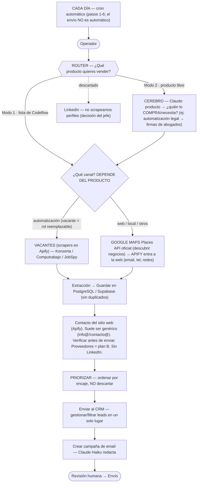

# Codeflow — Buscador de leads B2B · Estado actual (fuente de verdad)

> **Léeme primero.** Documento auto-contenido: si eres una IA o una persona nueva en el proyecto,
> esto te da el contexto del negocio sin explicación extra — **qué es esto, para quién, y qué
> decidió el jefe**.
>
> **Jerarquía de documentos** (para resolver contradicciones sin adivinar). Cada uno manda en su tema:
>
> | Tema | Manda |
> |---|---|
> | Arquitectura y capas | `docs/ARCHITECTURE.md` |
> | Modelo de datos y estados | `docs/DATABASE.md` |
> | Plan, alcance y orden de trabajo | `ROADMAP.md` |
> | Contexto del negocio y decisiones del jefe | **este archivo** |
> | Proveedores, precios, riesgo legal | `PROPUESTA-TECNICA.md` + `investigacion/` (respaldo) |
> | Material para presentar | `PRESENTACION-PPT.md`, `flujo-diario.md`, `diagrama-arquitectura.html` |
>
> Estado: **diseño congelado · código en curso (Fase 0)** · v4 · 25 jul 2026 · Mercado: LATAM, foco Panamá.
> **Alcance v1: Modo 1 sobre canal Google Maps, de punta a punta.**

## Qué es

**Codeflow** es una empresa de IA y automatización para LATAM: vende automatizaciones, sitios web, IA local, etc. Este proyecto es una **herramienta interna** para encontrarle clientes a esos productos.

Flujo general: el operador dice qué producto vender → la herramienta encuentra negocios que lo comprarían → consigue su contacto → los ordena por encaje → arma una campaña de correo (**revisada por un humano antes de enviar**).

## Los dos modos — el router pregunta "¿qué producto quieres vender?"

- **Modo 1:** vender un producto de la **lista que da el jefe** (una lista concreta, no las 5 líneas del pitch).
- **Modo 2:** escribes **cualquier producto** y Claude razona a **quién se lo venderías** — busca al **comprador**, no al productor:
  - "pan" → restaurantes / hoteles / cafés (**NO** panaderías).
  - "automatización de contratos legales" → firmas de abogados.

## Regla de diseño clave: el canal depende del PRODUCTO, no del modo

- **Vacantes de empleo** (scrapers corriendo en **Apify**: Konzerta, Computrabajo; + JobSpy que es librería gratis) → cuando vendes **automatización** (una vacante de rol repetitivo = empresa automatizable).
- **Google Maps + Apify** → cuando vendes **web / local / otros**: el usuario elige **categoría + ubicación**. La **Places API oficial de Google** descubre los negocios (nombre, dirección, teléfono, web, rating — **no trae email**); **Apify** entra al sitio web de cada uno y saca el contacto público (email, teléfono, redes). *(Existe un scraper de Apify que raspa Maps directo, pero preferimos la API oficial para descubrir — más limpio y es lo que pidió el jefe.)*

## Cómo se consigue el contacto (importante — ser preciso)

- El contacto sale del **propio sitio web del negocio** (lo saca Apify): email, teléfono, redes. Es la mejor fuente para negocio local panameño.
- **Suele ser un buzón genérico** (`info@`, `contacto@`), NO el correo nominal del dueño. En un negocio local pequeño ese buzón *es* el dueño — pero **no prometer "el correo del tomador de decisión"** cuando en realidad es genérico.
- **Verificar el email antes de enviar** (que exista, que no rebote) → protege el dominio.
- Proveedores tipo **Apollo/Hunter = plan B**, solo si el sitio web no trae contacto.
- **Sin LinkedIn:** no scrapeamos perfiles nosotros. *Matiz:* los proveedores plan B pueden tener datos de origen LinkedIn; lo que evitamos es scrapear perfiles nosotros mismos.

## Automatización (cron diario)

- La herramienta corre **cada día automáticamente**, pero **solo los pasos 1–6** (buscar → extraer → guardar → CRM → armar campaña).
- **El envío NO es automático:** el último paso es **revisión humana**. El cron arma la lista de leads a diario; una persona aprueba antes de que salga cualquier correo.

## Almacenamiento y CRM

- **Guardar en PostgreSQL** (Supabase = PostgreSQL, ya en el stack), sin duplicados.
- **"Enviar al CRM"** = gestionar/filtrar los leads en un solo lugar. **Por definir:** si es una **vista filtrable sobre Supabase** (en Vercel) → costo cero; si es un **CRM externo** (HubSpot, etc.) → integración y costo nuevos. *(Pregunta para el jefe.)*

## Decisiones del jefe

- **LinkedIn:** fuera como scraping propio (riesgo de baneo/legal).
- **Modelo de IA:** Claude Haiku 4.5 (barato y suficiente). Usar la cuenta de **project manager**. ~$5 de crédito para empezar.
- **Solo datos públicos**, respetando las normativas aplicables.

## Etapa y filosofía

- Solo investigación, no código.
- Como apenas arrancamos, **casi todo negocio es cliente potencial**: la herramienta **PRIORIZA** (ordena a quién contactar primero), **NO descarta**. Lo único fijo es la **dirección** (venderle al comprador correcto), no el filtro.

## El pipeline

## Stack deseado (recomendado)

Todo se apoya en lo que la empresa **ya paga** (Claude, Supabase, Vercel); el costo nuevo es chico.

| Capa | Herramienta recomendada | Estado |
|---|---|---|
| Router + "cerebro" (producto → ¿quién compra?) | **Claude Haiku 4.5** (API) | ya pagado |
| Descubrimiento · automatización | **Vacantes** vía **Apify** (Konzerta, Computrabajo) + **JobSpy** (OSS, gratis) | Apify = nuevo |
| Descubrimiento · web / local | **Google Maps Places API** (oficial) — categoría + ubicación → negocios (nombre, dir., tel., web, rating; **no email**) | nuevo (capa gratis) |
| Extracción de contacto | **Apify** entra al **sitio web** del negocio → email / tel / redes públicas | Apify = nuevo |
| Contacto · plan B | **Apollo / Hunter** solo si la web no trae contacto (cobertura Panamá floja) | nuevo (opcional) |
| Verificación de email | **MillionVerifier** (o Bouncer) antes de enviar → protege el dominio | nuevo (~centavos) |
| Base de datos | **Supabase (PostgreSQL)** — dedup por dominio + nombre normalizado | ya pagado |
| CRM / gestión de leads | **Vercel** (panel filtrable sobre Supabase) · CRM externo = opcional | ya pagado |
| Scoring / priorización | **reglas + Claude Haiku** — ordenar por encaje, NO descartar | ya pagado |
| Redacción del correo | **Claude Haiku 4.5** (Sonnet 5 solo para alto ticket) | ya pagado |
| Automatización diaria | **Cron** (Vercel Cron o `pg_cron` de Supabase) — solo pasos 1–6 | ya pagado |
| Envío del correo | Dominio dedicado + warm-up + opt-out (ESP por definir) | **fuera de la tubería · por definir** |

**Runtime sugerido:** TypeScript/Node en Vercel (nativo) para el panel y la orquestación. JobSpy es Python → corre como worker aparte, o se evita llamando los scrapers de vacantes vía Apify para no mezclar lenguajes. *(Decisión menor.)*

**Costo nuevo aprox.:** Apify ~$29–49/mes · Google Maps Places API por request (la capa gratis cubre el arranque) · verificador ~$5/mes · Claude ~$3/mes a 1.000 correos. El resto ya está pagado.

## Decisiones pendientes (confirmar con el jefe)

1. **¿El "CRM" es interno o externo?** Vista sobre Supabase (costo cero) vs CRM externo tipo HubSpot (integración + costo).
2. **¿El Modo 1 usa el "cerebro"?** ¿La lista del jefe ya trae las categorías de negocio a buscar, o Claude también las razona?
3. **Verificación de email** antes de enviar (que no rebote) — protege el dominio.
4. **Setup de envío** (dominio dedicado, warm-up, opt-out) — fuera de la tubería, pero necesario para que los correos lleguen.
5. **Señal exacta de priorización** — por ahora: ordenar por encaje, sin filtrar duro.

---

*Vistas del mismo sistema: `diagrama-arquitectura.html` (arquitectura ramificada, visual) · `flujo-diario.md` (tubería lineal de 7 pasos, para presentar). Investigación detallada de proveedores/precios/riesgos legales: `PROPUESTA-TECNICA.md` (respaldo).*
